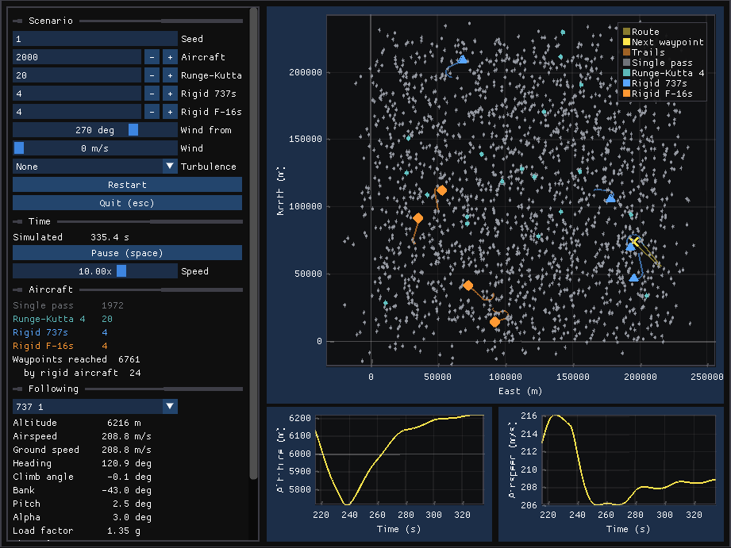

# simon

Simulation Out of the Box: a C++26 framework for entity-component simulations
that run at scale, with higher fidelity as an opt-in that costs nothing for
simulations that don't use it.

## What this proves

simon is a framework for entity-component simulations. Its flight
application shows that the framework can carry a flight simulator comparable
to [JSBSim](https://github.com/JSBSim-Team/jsbsim), a widely used open-source
flight dynamics model. The application's physics matches JSBSim's layer by
layer for two very different aircraft, a 737 airliner and an F-16 fighter,
and one thread flies a hundred thousand aircraft at mixed fidelity.
Each claim below names the command that checks it. Timings are GCC builds on
one core of an AMD Ryzen 9 5900XT. The details are in
[documents/design.md](documents/design.md#flight).

### The physics matches JSBSim

An offline converter (`tools/jsbsim/convert.py`) turns JSBSim's aircraft
into simon's own format, and the same code converts both. The F-16 brings
what the 737 lacks: fly-by-wire flight controls that close loops on roll
rate, pitch rate and load factor through PIDs and switches, an afterburning
engine, and a pilot whose accelerations the flight controls feel. The
application rebuilds each layer of each aircraft, and each layer is tested
against tables recorded from JSBSim:

| Test | Checks | 737 | F-16 |
|---|---|---:|---:|
| `aero_test` | Aerodynamic forces and moments at 240 and 300 states, from ground effect to Mach 1.36 | 5e-14 | 9e-15 |
| `rigid_body_test` | Equations of motion, air data and mass balance at 480 states, at the equator and 60° north | 5e-13 | |
| `turbine_test` | Spools, thrust and fuel flow, frame by frame through throttle steps, and for the F-16 into reheat and out | 1e-13 | 1e-13 |
| `flight_control_test` | Every block's output, frame by frame: the 737's surfaces through command sweeps, and all 60 blocks of the F-16's fly-by-wire through three flights | 4e-15 | 2e-16 |

These differences are rounding in double precision. Both aircraft share the
equations of motion, and the F-16's mass, center of mass and inertia, its
pilot included, match JSBSim's to within JSBSim's rounded slug, 1.4e-8.

```sh
bazel test //application/flight:aero_test //application/flight:rigid_body_test \
    //application/flight:turbine_test //application/flight:flight_control_test
```

### Both whole aircraft match JSBSim

`check_case_test` flies the 737 open loop for 30 s from JSBSim's trim at 6 km,
round the rotating WGS84 Earth, through three doublets and a throttle step.
The reference is JSBSim at 0.5 ms, where its integrators have converged. The
largest distance from that reference over 30 s:

| Case | simon at 0.5 ms | simon at 8 ms | JSBSim at 8 ms |
|---|---:|---:|---:|
| Trim hold | 2.1 mm | 2.8 mm | 1.6 mm |
| Elevator doublet | 0.9 mm | 1.3 mm | 8.9 mm |
| Aileron doublet | 2.2 mm | 6.1 mm | 11.7 mm |
| Rudder doublet | 2.4 cm | 3.8 cm | 41.5 cm |
| Throttle step | 3.9 mm | 6.0 cm | 11.9 cm |

The first column shows the application's physics agreeing with JSBSim's to
millimeters. At the same 8 ms step, the framework's Runge-Kutta 4 lands closer
to the converged answer in every case with an input, and 11 times closer after
the rudder doublet. The application also leaves out three of JSBSim's
shortcuts. It has no one-frame lags in induced drag, angle-of-attack rate or
flight-control inputs, it computes geodetic altitude exactly, and it uses exact
unit constants.

The F-16 flies the same five cases from its own trim, with the stick in
place of the elevator and aileron, and its throttle step into reheat. Its
flight controls run every 8 ms in simon and in the reference alike, as a
digital flight control computer runs at its own rate. Its control laws
differentiate the pilot's commands and then clip them, so run at every frame
they change with the frame and never converge. The reference is JSBSim at
0.125 ms:

| Case | simon at 0.5 ms | simon at 8 ms | JSBSim at 8 ms |
|---|---:|---:|---:|
| Trim hold | 3.7 mm | 3.7 mm | 0.05 mm |
| Pitch doublet | 2.1 mm | 2.1 mm | 1.5 cm |
| Roll doublet | 5.6 cm | 5.6 cm | 3.53 m |
| Rudder doublet | 3.7 mm | 3.7 mm | 0.8 mm |
| Throttle step into reheat | 1.1 cm | 14.7 cm | 63.2 cm |

simon has converged at 8 ms in every case but the step into reheat. It stays
within 4 mm of the reference, and within 6 cm after the roll doublet, where
JSBSim has itself converged only to about 5 cm. At 8 ms simon is 63 times
closer than JSBSim after the roll doublet, and 4 times closer after the
throttle step.

```sh
bazel test //application/flight:check_case_test   # about 3 minutes
```

### It flies the 737 through its flight controls

The 737's flight controls are JSBSim's model of the airliner's, converted
block for block. They move the surfaces where the pilot's controls and trims
put them, with one loop, a yaw damper:

| Channel | What the controls do |
|---|---|
| Pitch | Stick and pitch trim, together, move the elevator up to 17° each way |
| Roll | Wheel and roll trim move the ailerons up to 20°, one up as the other goes down |
| Yaw | Pedals, yaw trim and a yaw damper, which feeds back the yaw rate above Mach 0.11, move the rudder up to 20° |
| Flaps | An actuator moves them through eight detents, taking 2 to 5 s for each |
| Gear | An actuator takes 5 s to lower or raise it |
| Spoilers | Actuators move the flight and ground spoilers, each fully in 0.6 s |

That is 18 blocks: summers, scheduled gains, surface scales and actuators.
Replayed through 15 s of recorded commands, which sweep the stick, wheel and
pedals, step the trims, and move the flaps, gear, speedbrake and spoilers,
every surface agrees with JSBSim's to 4e-15 on every frame.

```sh
bazel test //application/flight:flight_control_test
```

### It flies the F-16 through its fly-by-wire

The F-16's flight controls are JSBSim's model of its fly-by-wire, converted
block for block. The pilot's stick and rudder command rates and load, and the
controls close the loops:

| Channel | Loop |
|---|---|
| Roll | A PID on the commanded roll rate less the aircraft's |
| Pitch | A PID on the commanded pitch rate and load factor, the stick's nose-down travel limited to 44% for 9 g up and 4 g down, and its authority falling to zero at 30° angle of attack |
| Yaw | A PID on the commanded yaw rate and the pilot's lateral acceleration |
| Flaps | Leading-edge flaps by angle of attack and Mach, trailing-edge flaps below 250 kt |
| Speedbrake | Out when commanded, or above 53° angle of attack with little sideways velocity |
| Throttle | Doubled, so the second half of its travel lights the reheat |

That is 60 blocks: summers, gains, scheduled gains, surface scales and
actuators, with 11 switches, 3 PIDs and a function. The controls read the
state a real flight control computer senses: calibrated airspeed, by JSBSim's
pitot formulas, ground speed, body velocity, attitude, and the accelerations
the pilot feels at the eye point. The flight controls can run at a fixed
period, as a digital flight control computer does, whatever step the dynamics
take; the check cases run them every 8 ms.

Replayed through three recorded flights, every block's output agrees with
JSBSim's to 2e-16 on every frame. The flights cruise while the stick, rudder
and throttle sweep, pull to high angle of attack below 250 kt, and fly
supersonic.

```sh
bazel test //application/flight:flight_control_test
```

### It trims its own aircraft

simon finds its own trim. Angle of attack, throttle, pitch trim, bank, aileron
and rudder balance every acceleration, solved together by Newton's method to
1e-13, with the F-16's fly-by-wire settled in the balance. Trimmed straight in
space, as JSBSim trims, simon's controls agree with JSBSim's to a few parts in
10^5, the tolerance JSBSim's trim stops at. By default simon trims level over
the round Earth instead, turning with the horizon, so the aircraft holds its
altitude where a straight path climbs as the Earth curves away.

The largest change in altitude and airspeed in 30 s, at 6 km and 200 m/s:

| Trim | 737 | F-16 |
|---|---:|---:|
| JSBSim's | 4.0 m, 0.19 m/s | 2.1 m, 0.081 m/s |
| simon's | 2.0 m, 0.10 m/s | 16 cm, 0.013 m/s |
| simon's, mass held | 3.7 mm, 0.2 mm/s | 2.4 mm, 0.1 mm/s |

Burning fuel lightens the aircraft, which climbs and speeds up. With the mass
held, the trim alone is measured.

```sh
bazel test //application/flight:trim_test
bazel test //application/flight:check_case_test --test_arg=HoldsTrim
```

### It runs faster than JSBSim

| Rigid 737s | Flat Earth | Round Earth |
|---:|---:|---:|
| 100 | 1.19 µs | 2.26 µs |
| 1,000 | 1.18 µs | 2.27 µs |
| 10,000 | 1.23 µs | 2.37 µs |

The cost per aircraft-step stays flat with population. JSBSim takes 9.2 µs a
frame for one 737, timed through its Python module. The comparison is rough,
since JSBSim's frame also runs ground reactions and its property tree. Even so,
the application evaluates the aircraft four times a step to JSBSim's once and
is 4 times faster round the Earth, and 7.8 times over a flat one. One thread
flies about 6,700 rigid 737s in real time over a flat Earth.

```sh
bazel run -c opt //application/flight:rigid_benchmark
```

### It scales

Point-mass aircraft fly routes under an autopilot, at 20 ms steps:

| Aircraft | Single pass | Runge-Kutta 4 |
|---:|---:|---:|
| 1,000 | 0.07 ms | 0.17 ms |
| 10,000 | 0.72 ms | 1.87 ms |
| 100,000 | 7.25 ms | 19.1 ms |

A single-pass aircraft costs about 73 ns a step at any population, so 100,000
of them run 2.8 times faster than real time.

```sh
bazel run -c opt //application/flight:flight_benchmark
```

### Fidelity costs only the aircraft that use it

The framework makes fidelity a choice per archetype. A level's systems run
only on entities whose components opt in, so a simulation pays nothing for a
level it doesn't use. One world at 100,000 aircraft:

| Aircraft | ms per step | Share |
|---|---:|---:|
| 98,900 single pass | 7.25 | 95.8% |
| 1,000 Runge-Kutta 4 | 0.18 | 2.3% |
| 100 rigid 737s | 0.14 | 1.8% |
| All | 7.57 | |

The single-pass aircraft cost the same per aircraft as they do alone. The
rigid 737s fly the same routes as everyone else, under a deliberately small
autopilot, and at the world's 20 ms step they stay within 15 cm of the
converged JSBSim reference.

```sh
bazel run -c opt //application/flight:flight_benchmark   # the mixed population
bazel run -c opt //application/flight -- 10000 100 10 10 # and 10 F-16s: 10 min in 25 s
```

### You can watch it



The viewer flies a mixed world in real time: 2,000 point-mass aircraft, 20 of
them on Runge-Kutta 4, with four rigid 737s and four rigid F-16s among them.
Its panel follows one rigid aircraft, with its route, air data, attitude,
engine and surfaces, and charts of its altitude and airspeed.

```sh
bazel run -c opt //application/flight:viewer
```

### Anyone can regenerate the references

Each JSBSim table comes from a script in
[application/flight/reference](application/flight/reference/README.md). The
tests compare against the committed tables, so they run without JSBSim. To
regenerate a table, run its script after `pip install jsbsim numpy`.

### What it does not show yet

- **Point-mass accuracy.** The point-mass model drifts 1.8 km from JSBSim
  over a 130 km flight (`accuracy_test`). Its fitted drag polar causes most of
  that drift. The model suits traffic at scale, and the rigid model suits
  handling.
- **Ground, wind and stall.** Routes stay between 3 and 9 km.

## Build

Requires [Bazelisk](https://github.com/bazelbuild/bazelisk) (installed as
`bazel`); the Bazel release is pinned in `.bazelversion`. All dependencies,
SDL2 included, come from the Bazel Central Registry, except the shared core
libraries in the [lib](https://github.com/sempuki/lib) submodule:

```sh
git clone --recurse-submodules git@github.com:sempuki/simon.git
# or, in an existing clone:
git submodule update --init

bazel test //...
bazel run //application/hello
bazel run //application/missile:viewer   # watch a missile scenario
bazel run -c opt //application/flight:viewer   # watch the flight world
bazel run //application/missile -- 7    # run seed 7 headless
bazel run //application/flight -- 1000 100   # 1,000 aircraft, 100 on RK4
bazel run -c opt //application/flight:flight_benchmark
```

Code targets C++26; flags come from `@lib//bazel:copts.bzl`.

The architecture, its decisions and the roadmap are in
[documents/design.md](documents/design.md).

## Editor setup

clangd needs a `compile_commands.json`, and the headers it names must stay put.
Bazel's execution root does not: every build relinks it to only the external
repositories that build needed. lib's `bazel/lsp_mirror.py` builds in an output
base of its own, copies the headers clangd reads into `.lsp/mirror/` (ignored
by git and Bazel), and writes `compile_commands.json` against that mirror, so
builds and compiler switches never disturb your editor:

```sh
python3 2nd_party/lib/bazel/lsp_mirror.py                  # build the mirror now
python3 2nd_party/lib/bazel/lsp_mirror.py --if-stale       # only if anything changed
python3 2nd_party/lib/bazel/lsp_mirror.py --watch 60       # check every minute
python3 2nd_party/lib/bazel/lsp_mirror.py --install-hooks  # after checkout, merge, rebase
```

`--if-stale` takes a fraction of a second when nothing changed, so it is cheap
to run often. Restart clangd (`:LspRestart` in Neovim) after the first build.
