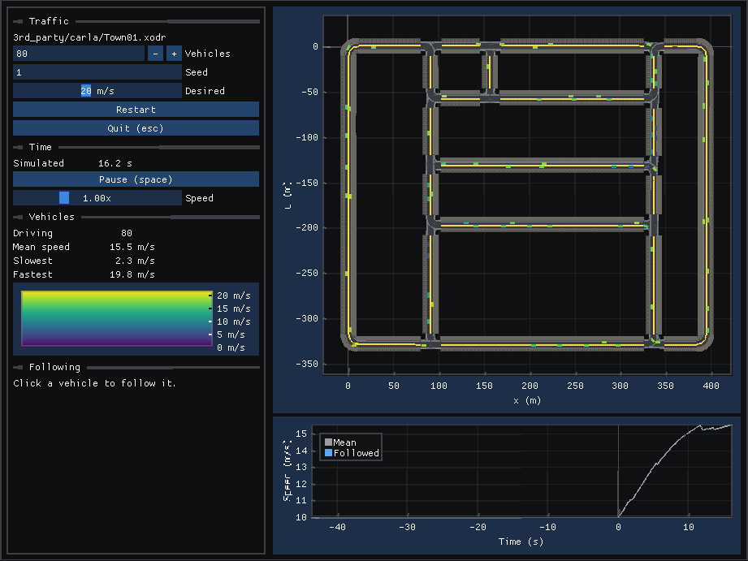

# automotive

The automotive application shows that simon's framework can carry a
closed-loop driving simulation, at the level of objects, comparable to the
best open source. Each claim is checked against an open reference, and the
details are in [Design.md](Design.md).
Its roads come first: read from ASAM OpenDRIVE, their positions, lane
borders and lanes match [libOpenDRIVE](https://github.com/pageldev/libOpenDRIVE)
to 8e-14 m on test roads of every geometry and on CARLA's Town01. On
parametric cubics simon follows the exact arc length to 1e-13 m, where
libOpenDRIVE's table of chords is 5.4 mm off. Its lane graph matches
libOpenDRIVE's routing graph edge for edge.

Traffic drives those lanes. Its vehicle model matches CommonRoad's kinematic
single-track model to 2e-16, its drivers follow by the Intelligent Driver
Model and change lanes by MOBIL, matching their authors' implementation, and
a platoon follows SUMO's to its converged solution: 1 cm, where SUMO at its
usual step is 1 m off.

Vehicles stop at traffic lights, give way at junctions and yield at
crosswalks, and pedestrians walk the sidewalks and decide when to cross:
stops at lights match SUMO's, gaps are accepted by Harders' rule, and
pedestrians wait as long as the Highway Capacity Manual's rules have them
wait, at lights and in traffic.

Beyond the kinematic model, the dynamic and drift single-track models, the
Magic Formula tire and the 29-state multibody model match CommonRoad's to
rounding, with four of CommonRoad's slips corrected from their sources; one
of them made its tire brake by 600 N rolling free.

Through the handling maneuvers, ISO 4138, ISO 7401 and FMVSS 126, the
multibody model with the full Magic Formula 5.2 tire drives Project
Chrono's Sedan to Chrono's step-steer yaw rate within 0.2% and its
understeer gradient within 0.01 deg/g at 80 km/h, its suspension measured
from Chrono's as a kinematics and compliance rig would.

It plays ASAM OpenSCENARIO scenarios, their storyboards, triggers and
actions running in the ECS: esmini's cut-ins, lane changes, and a car and
two pedestrians at a junction's traffic lights play out as they do in
esmini, every entity at every step within its log's six decimals on
straight roads and 1.2 mm on a curved highway. Runs are measured by
nuPlan's comfort and time to collision, matching nuPlan's own code, on
vehicle boxes that match GEOS. A parameter distribution's permutations run
in batches on threads, each as it runs in esmini and measured as nuPlan
measures esmini's.

At scale, 100,000 vehicles on 3,770 km of lanes step in 25 ms on one
thread, 248 ns a vehicle, where SUMO takes 6.5 µs a vehicle on the same
network and drivers.
On a grid of 400 signalized junctions, 10,000 vehicles and 100,000
pedestrians step in 50 ms, 458 ns an entity, where SUMO takes 2.8 µs on the
same network, its vehicles slowing to the same speeds.

```sh
bazel test //application/automotive/...
bazel run -c opt //application/automotive -- 3rd_party/carla/Town01.xodr 60 120
bazel run -c opt //application/automotive:automotive_benchmark
bazel run -c opt //application/automotive:automotive_benchmark -- --grid
bazel run //application/automotive:scenario -- 3rd_party/esmini/xosc/cut-in.xosc
bazel run -c opt //application/automotive:scenario_batch -- 3rd_party/esmini/xosc/cut-in_parameter_set.xosc
```



The viewer watches traffic on any OpenDRIVE network, here 80 vehicles in
CARLA's Town01 colored by speed, or plays an OpenSCENARIO scenario with the
ego's gap and time to collision charted under the map. A click on a vehicle
follows it.

```sh
bazel run -c opt //application/automotive:viewer -- 3rd_party/carla/Town01.xodr 80
bazel run -c opt //application/automotive:viewer -- 3rd_party/esmini/xosc/cut-in.xosc
```
