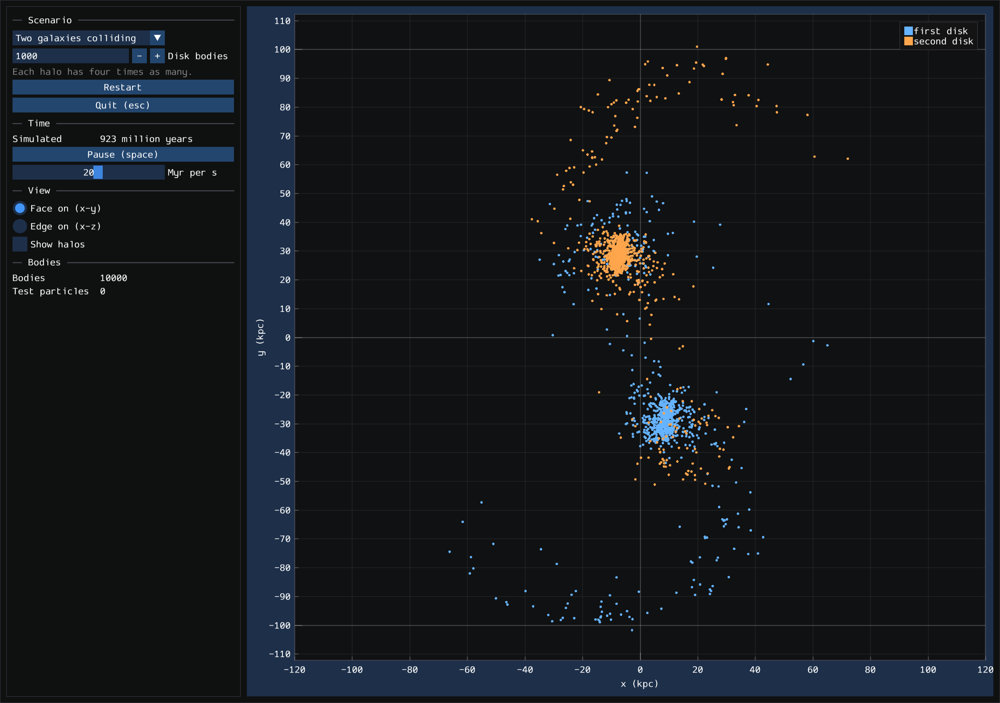

# galactic

Galaxies as bodies under each other's gravity, up to two disk galaxies
colliding and merging. A body stands for many stars or much dark matter: a
galaxy of 10^11 stars is sampled by 10^4 to 10^6 bodies, as galaxy codes
do. How it is built, and why, is in [Design.md](Design.md).

Gravity between bodies is softened by Plummer's kernel, and the leapfrog
steps it in kick-drift-kick form, as GADGET-2 does. Time counts whole Julian
years, so a run can last billions of years.

- **Gravity matches REBOUND to the last bit.** Summed directly over random
  clusters, softened and not, every body's acceleration equals REBOUND's
  exactly, because both add each pull in the same order with the same
  operations.
- **So does the leapfrog.** 400 steps of a 64-body cluster end where
  REBOUND's accelerations, kicked and drifted the same way, put them, bit for
  bit.
- **A Kepler orbit closes.** A body on a 10 kpc orbit of eccentricity 0.5
  around 10^11 solar masses returns to pericenter within 1.1 pc after one
  orbit of 4,000 steps, and the error falls fourfold when the steps double.

- **A Plummer sphere stays in equilibrium.** 4,000 bodies sampled by
  Aarseth, Hénon and Wielen's method fall within 5% of Plummer's mass
  profile at five radii and start within 5% of virial equilibrium. 256 of
  them, softened by 0.05 of the scale radius and run for ten crossing times
  at 128 steps each, keep their energy to 1.5 x 10^-4, their momentum and
  angular momentum to rounding, their virial ratio at 1.04 and their
  half-mass radius within 2.5%.
- **Barnes and Hut's tree errs as REBOUND's does.** On 2,000 bodies of a
  Plummer sphere at an opening angle of 0.5, its median force error is 0.29%
  and its 99th percentile 1.6%, to REBOUND's 0.25% and 1.7%, and so on at
  0.25, 0.75 and 1. With every cell opened it equals direct summation to
  4 x 10^-15. Its forces are not equal and opposite, so over ten crossing
  times momentum drifts by 9 x 10^-4 of the sphere's, and energy by
  9 x 10^-4, where direct summation keeps them to rounding and 1.5 x 10^-4.
- **Toomre and Toomre's encounter plays out as they found it.** Two masses
  of 10^11 suns pass within 25 kpc on a parabolic orbit, the first carrying
  their disk of 120 test particles, which feel gravity and exert none. Its
  outer ring turns in their 544.2 million years. Stepped by REBOUND's
  accelerations, the whole encounter, a billion years either side of
  pericenter, matches it bit for bit. The companion tears off a bridge and
  captures 27 of the particles, where they report 28; their rings' phase
  is not given, and turning every ring half a spacing gives 28.
- **A disk galaxy keeps its shape.** A disk of 5 x 10^10 suns in a halo of
  5 x 10^11, set up by Hernquist's (1993) moments of the collisionless
  Boltzmann equation with Hernquist's (1990) halo, starts as designed: its
  half-mass radius within 1% of the profile's, its thickness within 2.4% of
  the sech^2 layer's, Q at 1.56 where 1.5 was asked, and rotation 97% of
  circular, the rest asymmetric drift. On the tree, 2,000 disk and 8,000
  halo bodies keep their half-mass radius within 0.5% and thickness within
  0.4% for 100 million years. Like Hernquist's, the galaxy is halo-dominated
  and its disk is 0.2 of its scale length thick; a disk that dominates its
  inner halo, or half as thick, starts swelling within 50 million years.

- **Two disk galaxies collide and merge as they do in REBOUND.** Two
  standard galaxies, 20,000 bodies, pass within 15 kpc, swing out to 52 kpc,
  fall back and merge within 1.3 billion years, throwing a fifth of their
  disks into tails. REBOUND's tree, run from simon's start, follows the same
  arc: the same pericenter to 0.4 kpc, an apocenter 3% nearer, and the same
  merger, before the runs part as chaotic runs do. Energy drifts by 0.36%
  over 2 billion years in steps of a million years.
- **It scales past REBOUND.** On one thread, the tree steps 100,000 bodies
  in 1.37 s to REBOUND's 2.27, and a million test particles in 17.6 ms to
  its 35.2. Direct summation is 1.3x slower, since each body computes each
  pair for itself so that bodies run in any order; per pair it is 1.5x
  faster.

```sh
bazel test //application/galactic/...
bazel run -c opt //application/galactic:viewer             # watch two galaxies collide
bazel run -c opt //application/galactic -- collision       # run it headless
bazel run -c opt //application/galactic -- disk 4000 500   # one galaxy alone
bazel run -c opt //application/galactic:galactic_benchmark -- tree 100000 5
```



The viewer shows the collision, a galaxy alone, or Toomre and Toomre's
encounter, face on or edge on, here two galaxies of 1,000 disk bodies each
near their first apocenter.

The reference tables, and the scripts that regenerate them from REBOUND,
are listed in [reference/README.md](reference/README.md).

## Credits

galactic measures itself against [REBOUND](https://rebound.readthedocs.io).
Thank you to Hanno Rein, Shangfei Liu and REBOUND's contributors for an
N-body code that is open, documented and easy to run beside another.

| Project | What galactic takes from it | License |
|---|---|---|
| [REBOUND](https://github.com/hannorein/rebound) 5.2.2 | The reference every check runs against, through its Python module. Its direct summation, which `model/gravity` follows in its order of operations (see `NOTICE.md`), and its tree's opening test, which simon's tree shares | GPL-3.0 |
| [GADGET-2](https://wwwmpa.mpa-garching.mpg.de/gadget/) | The leapfrog's kick-drift-kick form, from its paper; no code | |

The papers behind the physics are cited in
[model/REFERENCES.md](../../model/REFERENCES.md).
